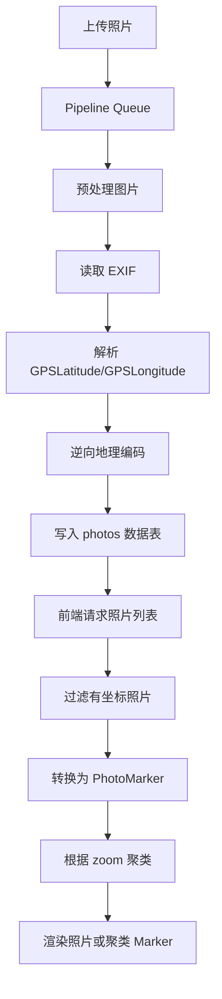

# ChronoFrame 地图展示实现调研

> 调研对象：[HoshinoSuzumi/chronoframe](https://github.com/HoshinoSuzumi/chronoframe)
>
> 调研范围：照片地图探索页、MapLibre/Mapbox 适配、照片点位聚类、EXIF GPS 数据链路、照片详情小地图以及地图相关交互。
>
> 调研基于仓库 `main` 分支源码，重点关注地图展示部分，而不是完整的相册、上传和存储功能。

---

## 1. 结论概览

ChronoFrame 的地图实现可以概括为：

> **MapLibre/Mapbox 负责底图渲染，Vue 组件负责照片 Marker 和信息卡片，前端代码负责照片过滤与聚类。**

它没有直接使用 MapLibre/Mapbox 的 GeoJSON source clustering，而是：

1. 前端获取照片列表；
2. 筛选出包含经纬度的照片；
3. 把照片转换为地图 Marker 数据；
4. 根据当前缩放级别进行前端聚类；
5. 使用 Vue 组件渲染单照片 Marker 或聚类 Marker；
6. 通过 MapLibre/Mapbox 的 Marker 组件将自定义 DOM 内容放到地图坐标上。

因此，照片点位层和地图底图层是相互独立的：

- 底图：MapLibre/Mapbox Style、矢量瓦片、道路、城市、行政区等；
- 照片层：Vue 组件、HTML DOM、缩略图、HoverCard、动画和交互。

---

## 2. 核心源码位置

| 文件 | 作用 |
| --- | --- |
| [`app/app.vue`](https://github.com/HoshinoSuzumi/chronoframe/blob/main/app/app.vue) | 初始化设置、请求照片列表、向全局注入照片数据 |
| [`app/pages/globe.vue`](https://github.com/HoshinoSuzumi/chronoframe/blob/main/app/pages/globe.vue) | 地图探索页面，负责地图状态、过滤、聚类和交互 |
| [`app/components/map/Provider.vue`](https://github.com/HoshinoSuzumi/chronoframe/blob/main/app/components/map/Provider.vue) | 统一封装 MapLibre 和 Mapbox |
| [`app/components/map/ProviderMarker.vue`](https://github.com/HoshinoSuzumi/chronoframe/blob/main/app/components/map/ProviderMarker.vue) | 统一封装两种地图的 Marker |
| [`app/components/map/PhotoPin.vue`](https://github.com/HoshinoSuzumi/chronoframe/blob/main/app/components/map/PhotoPin.vue) | 单张照片 Marker |
| [`app/components/map/ClusterPin.vue`](https://github.com/HoshinoSuzumi/chronoframe/blob/main/app/components/map/ClusterPin.vue) | 聚类 Marker |
| [`app/components/map/LocationPicker.vue`](https://github.com/HoshinoSuzumi/chronoframe/blob/main/app/components/map/LocationPicker.vue) | 点击地图选择经纬度 |
| [`app/components/photo/MiniMap.vue`](https://github.com/HoshinoSuzumi/chronoframe/blob/main/app/components/photo/MiniMap.vue) | 照片详情页中的小地图 |
| [`app/utils/clustering.ts`](https://github.com/HoshinoSuzumi/chronoframe/blob/main/app/utils/clustering.ts) | 照片转换和前端聚类算法 |
| [`shared/types/map.ts`](https://github.com/HoshinoSuzumi/chronoframe/blob/main/shared/types/map.ts) | 地图实例、照片 Marker 和聚类点类型 |
| [`server/api/photos/visible.get.ts`](https://github.com/HoshinoSuzumi/chronoframe/blob/main/server/api/photos/visible.get.ts) | 获取公开照片，过滤隐藏相册中的照片 |
| [`server/database/schema.ts`](https://github.com/HoshinoSuzumi/chronoframe/blob/main/server/database/schema.ts) | 照片 GPS、城市、国家等字段定义 |
| [`server/services/location/geocoding.ts`](https://github.com/HoshinoSuzumi/chronoframe/blob/main/server/services/location/geocoding.ts) | EXIF GPS 解析和逆向地理编码 |
| [`server/services/pipeline-queue/manager.ts`](https://github.com/HoshinoSuzumi/chronoframe/blob/main/server/services/pipeline-queue/manager.ts) | 上传后的 EXIF、GPS、缩略图和地理位置处理流水线 |
| [`app/assets/mapStyles/chronoframe_light.json`](https://github.com/HoshinoSuzumi/chronoframe/blob/main/app/assets/mapStyles/chronoframe_light.json) | MapLibre 浅色底图样式 |
| [`app/assets/mapStyles/chronoframe_dark.json`](https://github.com/HoshinoSuzumi/chronoframe/blob/main/app/assets/mapStyles/chronoframe_dark.json) | MapLibre 深色底图样式 |
| [`server/services/settings/contants.ts`](https://github.com/HoshinoSuzumi/chronoframe/blob/main/server/services/settings/contants.ts) | 地图 provider、token、style 等配置项 |

---

## 3. 总体数据链路

### 3.1 上传照片到地图数据



### 3.2 地图页面渲染

```mermaid
flowchart TD
    A[app.vue 初始化设置] --> B[请求照片 API]
    B --> C[PhotosProvider 注入照片]
    C --> D[/globe 页面]
    D --> E[photosWithLocation]
    E --> F[photosToMarkers]
    F --> G[clusterMarkers]
    G --> H[clusterGroups]
    G --> I[singleMarkers]
    H --> J[MapClusterPin]
    I --> K[MapPhotoPin]
    J --> L[ProviderMarker]
    K --> L
    L --> M[MapLibre 或 Mapbox Marker]
```

---

## 4. 照片列表的获取方式

照片列表在 [`app/app.vue`](https://github.com/HoshinoSuzumi/chronoframe/blob/main/app/app.vue) 中统一请求，并通过 `PhotosProvider` 注入到页面和组件中。

请求接口根据路由和登录状态决定：

```ts
const apiEndpoint = computed(() => {
  if (route.path.startsWith('/dashboard')) {
    return '/api/photos'
  }

  return loggedIn.value
    ? '/api/photos'
    : '/api/photos/visible'
})
```

含义如下：

- 管理后台使用 `/api/photos`，返回全部照片；
- 已登录用户使用 `/api/photos`，返回全部照片；
- 未登录用户使用 `/api/photos/visible`，只返回公开照片。

`/api/photos/visible` 会查询隐藏相册中的照片 ID，然后排除这些照片：

```ts
.where(notInArray(tables.photos.id, hiddenPhotoIds))
```

地图本身没有单独的“按地图范围查询照片”接口，也没有使用 viewport、分页或地图瓦片加载照片点位，而是复用全局照片列表。

---

## 5. 地图页面：`app/pages/globe.vue`

地图探索页使用：

```ts
const { photos } = usePhotos()
```

然后筛选有 GPS 坐标的照片：

```ts
const photosWithLocation = computed(() => {
  return photos.value.filter(
    (photo) =>
      photo.latitude !== null &&
      photo.longitude !== null &&
      photo.latitude !== undefined &&
      photo.longitude !== undefined,
  )
})
```

### 5.1 地图初始中心和缩放级别

项目会根据所有照片的坐标范围计算初始地图状态：

1. 求所有照片的最小、最大经纬度；
2. 计算经纬度范围的中心点；
3. 根据最大跨度估算 zoom。

大致规则如下：

| 坐标最大跨度 | 初始 zoom |
| ---: | ---: |
| `< 0.005` | 16 |
| `< 0.02` | 14 |
| `< 0.05` | 12 |
| `< 0.2` | 10 |
| `< 1` | 8 |
| `< 5` | 6 |
| `< 20` | 5 |
| `< 50` | 4 |
| 其他 | 2 |

没有照片坐标时使用默认视角：

```ts
longitude: -122.4
latitude: 37.8
zoom: 2
```

### 5.2 地图实例和缩放状态

地图加载完成后保存原生地图实例：

```ts
const mapInstance = ref<any>(null)

const onMapLoaded = (map: any) => {
  mapInstance.value = map
  currentZoom.value = map.getZoom()
}
```

地图缩放事件使用 `useThrottleFn`，以 100ms 频率更新当前 zoom：

```ts
const onMapZoom = useThrottleFn(() => {
  currentZoom.value = mapInstance.value.getZoom()
}, 100)
```

当前 zoom 会触发聚类结果重新计算。

---

## 6. MapLibre/Mapbox Provider 抽象

### 6.1 `MapProvider.vue`

[`app/components/map/Provider.vue`](https://github.com/HoshinoSuzumi/chronoframe/blob/main/app/components/map/Provider.vue) 通过设置决定地图实现：

```ts
const mapConfig = computed(() => {
  const config = getSetting('map')
  return typeof config === 'object' && config ? config : {}
})

const provider = computed(() => mapConfig.value.provider || 'maplibre')
```

模板中根据 provider 选择组件：

```vue
<MglMap
  v-if="provider === 'maplibre'"
  :map-style="mapStyle"
/>

<MapboxMap
  v-else
  :options="{ ... }"
/>
```

所有地图都放在 `ClientOnly` 内，因为 MapLibre/Mapbox 依赖浏览器 DOM 和 WebGL，不能直接在 SSR 阶段初始化。

### 6.2 MapLibre 样式

MapLibre 默认使用 ChronoFrame 自带的浅色或深色 Style JSON：

```ts
const styleConfig =
  colorMode.value === 'dark'
    ? ChronoFrameDarkStyle
    : ChronoFrameLightStyle
```

默认 Style 使用 MapTiler 的 OpenMapTiles 矢量瓦片：

```ts
sources: {
  openmaptiles: {
    url: `https://api.maptiler.com/tiles/v3-openmaptiles/tiles.json?key=${token}`
  }
}
```

字体使用：

```ts
glyphs: `https://api.maptiler.com/fonts/{fontstack}/{range}.pbf?key=${token}`
```

样式中的底图图层包括：

- `landuse`
- `landcover`
- `water`
- `waterway`
- `transportation`
- `building`
- `boundary`
- `place`
- `poi`
- `aeroway`

这些只负责道路、建筑、水系、城市、国家和行政区等底图元素，不包含照片点位。

### 6.3 Mapbox 样式

Mapbox 默认使用：

```ts
mapbox://styles/mapbox/standard
```

并根据当前主题配置 Standard Style 的底图状态：

```ts
config: {
  basemap: {
    lightPreset: dark ? 'night' : 'day',
    colorThemes: 'faded'
  }
}
```

项目也允许在设置中提供自定义 Mapbox Style 或 MapLibre Style。

---

## 7. 照片转换为 Marker

### 7.1 `photosToMarkers`

[`app/utils/clustering.ts`](https://github.com/HoshinoSuzumi/chronoframe/blob/main/app/utils/clustering.ts) 中的 `photosToMarkers()` 会把完整的 `Photo` 转换成地图专用的 `PhotoMarker`：

```ts
{
  id,
  latitude,
  longitude,
  title,
  thumbnailUrl,
  thumbnailHash,
  dateTaken,
  city,
  exif
}
```

Marker 不使用原图，而是使用：

- `thumbnailUrl`：照片缩略图 URL；
- `thumbnailHash`：ThumbHash，用于加载过程中的占位显示；
- `exif`：用于显示相机、焦距、快门、海拔等信息。

类型定义位于 [`shared/types/map.ts`](https://github.com/HoshinoSuzumi/chronoframe/blob/main/shared/types/map.ts)：

```ts
export interface PhotoMarker {
  id: string
  latitude: number
  longitude: number
  title?: string
  thumbnailUrl?: string
  thumbnailHash?: string
  dateTaken?: string
  city?: string
  exif?: any
}
```

---

## 8. 前端聚类算法

### 8.1 聚类入口

`globe.vue` 中使用当前过滤后的照片和当前 zoom 计算聚类：

```ts
const clusteredMarkers = computed(() => {
  const markers = photosToMarkers(filteredPhotosWithLocation.value)
  return clusterMarkers(markers, currentZoom.value)
})
```

随后分成两组：

```ts
const clusterGroups = computed(() => {
  return clusteredMarkers.value.filter(
    (point) => point.properties.cluster === true,
  )
})

const singleMarkers = computed(() => {
  return clusteredMarkers.value.filter(
    (point) => point.properties.cluster !== true,
  )
})
```

### 8.2 聚类阈值

当 zoom 大于等于 15 时，不再聚类：

```ts
if (zoom >= 15) {
  return markers.map((marker) => ({ ... }))
}
```

低缩放级别下，阈值计算如下：

```ts
const threshold = Math.max(
  0.001,
  0.01 / Math.pow(2, zoom - 10),
)
```

大致对应：

| zoom | 聚类阈值 |
| ---: | ---: |
| 8 | 约 0.04 |
| 10 | 约 0.01 |
| 12 | 约 0.0025 |
| 14 | 约 0.000625 |
| 15 以上 | 不聚类 |

两个点之间使用经纬度平面距离：

```ts
const distance = Math.sqrt(
  Math.pow(marker.longitude - other.longitude, 2) +
  Math.pow(marker.latitude - other.latitude, 2),
)
```

### 8.3 聚类实现方式

该算法是简单的贪心式遍历：

1. 取一个还未处理的照片；
2. 遍历其他未处理照片；
3. 把距离小于阈值的照片加入当前聚类；
4. 计算聚类中心；
5. 继续处理剩余照片。

聚类中心使用经纬度平均值：

```ts
const centerLng =
  nearby.reduce((sum, item) => sum + item.longitude, 0) /
  nearby.length

const centerLat =
  nearby.reduce((sum, item) => sum + item.latitude, 0) /
  nearby.length
```

聚类结果保留：

```ts
{
  cluster: true,
  point_count: nearby.length,
  marker: nearby[0],
  clusteredPhotos: nearby
}
```

其中 `marker` 是代表照片，`clusteredPhotos` 是该聚类中的全部照片。

这不是 Mapbox 的原生聚类，而是应用层自己生成类似 GeoJSON Feature 的结构。

---

## 9. 聚类 Marker：`ClusterPin.vue`

[`app/components/map/ClusterPin.vue`](https://github.com/HoshinoSuzumi/chronoframe/blob/main/app/components/map/ClusterPin.vue) 使用聚类中的第一张照片作为代表图：

```vue
<ThumbImage
  :src="representativePhoto.thumbnailUrl"
  :thumbhash="representativePhoto.thumbnailHash"
/>
```

Marker 中间显示聚类数量：

```vue
<span>{{ pointCount }}</span>
```

尺寸根据聚类数量计算：

```ts
const sizeDelta = computed(() => {
  const count = pointCount.value
  return Math.min(64, Math.max(44, 32 + Math.log(count) * 10))
})
```

因此：

- 最小尺寸约 44px；
- 最大尺寸约 64px；
- 照片越多，聚类圆点越大。

鼠标悬停时会显示聚类照片预览，默认最多 6 张：

```ts
clusteredPhotos.slice(0, clusterCount)
```

每张预览图都可以打开对应照片详情页。

### 点击聚类 Marker

点击聚类 Marker 后，父页面会：

1. 获取聚类内所有照片的坐标；
2. 计算最小和最大经纬度；
3. 调用地图实例的 `fitBounds`；
4. 让地图动画缩放到该聚类范围。

```ts
mapInstance.value.fitBounds(bounds, {
  padding: 50,
  duration: 1000,
})
```

地图缩放后会重新计算聚类，直到最终显示为单个照片 Marker。

---

## 10. 单照片 Marker：`PhotoPin.vue`

[`app/components/map/PhotoPin.vue`](https://github.com/HoshinoSuzumi/chronoframe/blob/main/app/components/map/PhotoPin.vue) 是单张照片的自定义 Marker。

Marker 内容包括：

- 照片缩略图背景；
- 半透明渐变层；
- 照片图标；
- 选中状态动画；
- 可选的参数分析徽章。

它使用 `ThumbImage` 加载缩略图，并使用 `motion-v` 实现出现、悬停和点击动画。

### 点击和选中

点击单张照片后，`globe.vue` 会设置：

```ts
currentClusterPointId.value = marker.id
```

该 ID 会同步到路由查询参数：

```ts
router.replace({
  query: {
    ...route.query,
    photoId: newId,
  },
})
```

因此选中的照片可以通过以下 URL 表示：

```text
/globe?photoId=PHOTO_ID
```

如果直接访问这个 URL，地图加载完成后会：

1. 查找对应照片；
2. `flyTo` 到照片坐标；
3. 缩放到 zoom 17；
4. 打开对应的照片卡片。

### 信息卡片

单照片卡片展示：

- 缩略图；
- 标题；
- 城市；
- 拍摄日期；
- 相机品牌和型号；
- GPS 坐标；
- 海拔；
- 跳转到照片详情页的链接。

照片详情链接使用新窗口打开：

```vue
<NuxtLink
  :to="`/${marker.id}`"
  target="_blank"
  rel="noopener"
>
```

---

## 11. 照片参数分析模式

地图页面提供参数分析功能：

```ts
const analysisMode = ref<
  'none' | 'focalLength' | 'shutterSpeed' | 'altitude'
>('none')
```

### 11.1 焦距模式

读取：

- `FocalLengthIn35mmFormat`；
- 如果没有，则读取 `FocalLength`。

分类：

| 范围 | 类型 |
| --- | --- |
| `<35mm` | 广角 |
| `35-85mm` | 标准 |
| `>85mm` | 长焦 |

### 11.2 快门模式

读取 `ExposureTime`，支持数字和分数格式，例如 `1/250`。

分类：

| 范围 | 类型 |
| --- | --- |
| `≤1/250s` | 快门快 |
| `1/250-1/30s` | 中等 |
| `>1/30s` | 慢速 |

### 11.3 海拔模式

读取：

- `GPSAltitude`；
- `GPSAltitudeRef`。

分类：

| 范围 | 类型 |
| --- | --- |
| `<200m` | 低海拔 |
| `200-1500m` | 中等 |
| `>1500m` | 高海拔 |

这些分析全部在 `PhotoPin.vue` 中完成，仅改变 Marker 的颜色、渐变和徽章，不会修改数据库。

---

## 12. 时间轴过滤

`globe.vue` 实现了基于照片拍摄时间的时间轴。

处理过程：

```text
有坐标照片
  -> 保留有 dateTaken 的照片用于计算时间范围
  -> 按拍摄时间排序
  -> 根据时间轴进度计算 cutoff 时间
  -> 过滤 cutoff 之后的照片
  -> 重新计算聚类
  -> 重新渲染地图 Marker
```

时间轴支持：

- 开启/关闭；
- 拖拽进度；
- 播放/暂停；
- 从最早日期播放到最晚日期；
- 显示当前日期；
- 显示当前照片数量。

播放时长为 12 秒：

```ts
const timelinePlayDurationMs = 12000
```

没有 `dateTaken` 的照片会始终保留：

```ts
if (!photo.dateTaken) {
  return true
}
```

时间轴并不直接控制地图实例，而是改变 `filteredPhotosWithLocation`，进而触发重新聚类。

---

## 13. Marker Provider 适配

[`app/components/map/ProviderMarker.vue`](https://github.com/HoshinoSuzumi/chronoframe/blob/main/app/components/map/ProviderMarker.vue) 根据当前 provider 选择不同的 Marker 组件：

```vue
<MapboxDefaultMarker
  v-if="provider === 'mapbox'"
  :lnglat
>
  <template #marker>
    <slot name="marker" />
  </template>
</MapboxDefaultMarker>

<MglMarker
  v-else
  :coordinates="lnglat"
>
  <template #marker>
    <slot name="marker" />
  </template>
</MglMarker>
```

业务层的 `PhotoPin` 和 `ClusterPin` 不需要知道使用的是 Mapbox 还是 MapLibre，只需要提供：

```vue
<MapProviderMarker :lnglat="coordinates">
  <template #marker>
    <!-- 自定义 Vue DOM -->
  </template>
</MapProviderMarker>
```

这使得照片 Marker 的 UI 和地图 SDK 解耦。

---

## 14. 照片详情页 MiniMap

[`app/components/photo/MiniMap.vue`](https://github.com/HoshinoSuzumi/chronoframe/blob/main/app/components/photo/MiniMap.vue) 复用 `MapProvider`，用于照片详情页中的位置预览。

特点：

- `interactive=false`，用户不能拖动地图；
- 默认 zoom 为 12；
- 中心显示一个脉冲点；
- 切换照片时使用 `flyTo`；
- 点击后打开 `/globe?photoId=...`。

```ts
mapInstance.value.flyTo({
  duration: 1000,
  center: [newLng, newLat],
  zoom: 12,
  essential: true,
})
```

在 Mapbox 模式下，MiniMap 还会根据照片拍摄时间调整底图光照：

- 05:00-07:00：`dawn`
- 07:00-17:00：`day`
- 17:00-21:00：`dusk`
- 其他时间：`night`

点击 MiniMap 后，会跳转到完整地图，并通过 `photoId` 自动定位和选中该照片。

---

## 15. LocationPicker

[`app/components/map/LocationPicker.vue`](https://github.com/HoshinoSuzumi/chronoframe/blob/main/app/components/map/LocationPicker.vue) 是另一个地图使用场景。

它用于用户在地图上点击选择坐标：

1. 监听底图的 `click` 事件；
2. 读取 `lngLat` 或 `latlng`；
3. 转换为 `{ latitude, longitude }`；
4. 触发 `update:modelValue` 和 `pick`；
5. 如果已有坐标，则显示 Marker 并移动地图中心。

```ts
emit('update:modelValue', {
  latitude,
  longitude,
})
```

该组件说明 `MapProvider` 不只服务于照片展示，还可以作为统一的坐标选择基础组件。

---

## 16. GPS 数据如何产生

上传照片后的主要处理逻辑位于：

[`server/services/pipeline-queue/manager.ts`](https://github.com/HoshinoSuzumi/chronoframe/blob/main/server/services/pipeline-queue/manager.ts)

处理阶段大致为：

```text
preprocessing
  -> metadata
  -> thumbnail
  -> exif
  -> reverse-geocoding
  -> motion-photo
  -> live-photo
```

EXIF 提取在：

[`server/services/image/exif.ts`](https://github.com/HoshinoSuzumi/chronoframe/blob/main/server/services/image/exif.ts)

GPS 解析和逆向地理编码在：

[`server/services/location/geocoding.ts`](https://github.com/HoshinoSuzumi/chronoframe/blob/main/server/services/location/geocoding.ts)

解析过程会尝试读取：

- `GPSLatitude`；
- `GPSLongitude`；
- `GPSLatitudeRef`；
- `GPSLongitudeRef`；
- `GPSCoordinates`。

并根据 `S`、`W` 方向修正南纬和西经的负号。

逆向地理编码支持：

1. Mapbox Search API；
2. OpenStreetMap Nominatim。

Mapbox token 存在时优先使用 Mapbox，否则回退到 Nominatim。

最终照片数据中保存：

```ts
{
  latitude,
  longitude,
  country,
  city,
  locationName,
  exif
}
```

数据库字段在 [`server/database/schema.ts`](https://github.com/HoshinoSuzumi/chronoframe/blob/main/server/database/schema.ts)：

```ts
latitude: real('latitude'),
longitude: real('longitude'),
country: text('country'),
city: text('city'),
locationName: text('location_name'),
exif: text('exif', { mode: 'json' })
```

如果开启上传时自动移除位置隐私信息，则会清除 EXIF GPS，并且不保存照片坐标。

---

## 17. 地图设置来源

地图设置定义在：

[`server/services/settings/contants.ts`](https://github.com/HoshinoSuzumi/chronoframe/blob/main/server/services/settings/contants.ts)

主要配置项：

```text
map:provider
map:mapbox.token
map:mapbox.style
map:maplibre.token
map:maplibre.style
```

前端启动时，`app.vue` 会先调用设置 Store：

```ts
await settingsStore.initSettings()
```

设置从以下 API 获取：

```text
/api/system/settings/all
```

地图设置页面位于：

[`app/pages/dashboard/settings/map.vue`](https://github.com/HoshinoSuzumi/chronoframe/blob/main/app/pages/dashboard/settings/map.vue)

当前版本的设计是“数据库设置 + 前端 Store”，环境变量配置会在服务端启动时迁移到设置系统中。

文档中的环境变量主要包括：

```bash
NUXT_PUBLIC_MAP_PROVIDER=maplibre
NUXT_PUBLIC_MAP_MAPLIBRE_TOKEN=your_token
NUXT_PUBLIC_MAPBOX_ACCESS_TOKEN=your_token
```

使用 MapLibre 时还可以配置自定义 Style；使用 Mapbox 时可以配置自定义 Mapbox Style。

---

## 18. 实现优点

### 18.1 地图 SDK 与业务组件解耦

通过 `MapProvider` 和 `MapProviderMarker`，照片 Marker 不需要关心底层是 MapLibre 还是 Mapbox。

### 18.2 Marker UI 定制能力强

因为 Marker 是 Vue/HTML 内容，所以可以直接使用：

- TailwindCSS；
- Motion 动画；
- ThumbHash 占位；
- HoverCard；
- NuxtLink；
- 任意照片元数据。

### 18.3 URL 可以表达当前照片

使用 `photoId` 查询参数，可以实现：

- 从照片详情页跳转地图；
- 直接分享某个地图照片位置；
- 页面刷新后恢复选中照片。

### 18.4 隐私过滤在服务端完成

未登录用户不会拿到隐藏相册中的照片数据，地图前端只对接口返回的数据进行展示。

### 18.5 EXIF 数据直接服务于地图 UI

地图不仅显示坐标，还可以使用 EXIF 实现：

- 相机信息展示；
- 焦距分析；
- 快门速度分析；
- 海拔分析；
- 拍摄日期时间轴。

---

## 19. 实现限制和可能的优化方向

### 19.1 前端聚类算法是 O(n²)

`clusterMarkers()` 使用双重遍历，照片数量较大时会增加计算开销。

可考虑：

- 使用 `supercluster`；
- 使用 MapLibre/Mapbox GeoJSON source clustering；
- 使用网格索引或 R-tree；
- 仅处理当前 viewport 内的照片。

### 19.2 使用经纬度平面距离

当前距离计算没有考虑地球曲率，也没有把经纬度转换为屏幕像素距离。

在以下情况可能产生误差：

- 高纬度地区；
- 跨越经度 ±180°；
- 不同纬度下相同经度差对应的实际距离不同。

更准确的实现可以使用：

- Haversine 距离；
- Web Mercator 投影；
- 地图 SDK 的屏幕坐标距离。

### 19.3 所有照片一次性加载

地图没有按照当前地图范围加载数据，因此照片数量大时会有：

- 首屏请求数据量大；
- 前端内存占用高；
- Vue Marker 数量多；
- 聚类重算成本高。

更大规模的数据集可以设计独立接口，例如：

```text
GET /api/map/photos?west=...&south=...&east=...&north=...&zoom=...
```

或者服务端直接输出矢量瓦片/聚合后的 GeoJSON。

### 19.4 DOM Marker 数量受限

自定义 DOM Marker 灵活，但每个 Marker 都对应 Vue/DOM 节点。照片量较大时，WebGL symbol layer 通常比大量 HTML Marker 更高效。

可以考虑分层策略：

- 低 zoom：WebGL 聚类图层；
- 中 zoom：GeoJSON symbol layer；
- 高 zoom：少量 Vue DOM Marker 和详情卡片。

### 19.5 逆向地理编码依赖外部服务

Nominatim 有请求频率限制，Mapbox 也有额度和 token 安全问题。批量导入大量照片时，逆向地理编码会成为队列处理瓶颈。

可以考虑：

- 按坐标缓存地理编码结果；
- 对相近坐标复用城市信息；
- 批量异步处理；
- 为失败任务提供重试和人工补偿机制。

---

## 20. 推荐源码阅读顺序

如果要继续深入研究，建议按以下顺序阅读：

1. [`app/app.vue`](https://github.com/HoshinoSuzumi/chronoframe/blob/main/app/app.vue) —— 照片列表和全局设置初始化；
2. [`app/pages/globe.vue`](https://github.com/HoshinoSuzumi/chronoframe/blob/main/app/pages/globe.vue) —— 地图页面主流程；
3. [`app/utils/clustering.ts`](https://github.com/HoshinoSuzumi/chronoframe/blob/main/app/utils/clustering.ts) —— Marker 转换和聚类；
4. [`app/components/map/Provider.vue`](https://github.com/HoshinoSuzumi/chronoframe/blob/main/app/components/map/Provider.vue) —— 地图 provider 抽象；
5. [`app/components/map/ProviderMarker.vue`](https://github.com/HoshinoSuzumi/chronoframe/blob/main/app/components/map/ProviderMarker.vue) —— Marker 适配；
6. [`app/components/map/PhotoPin.vue`](https://github.com/HoshinoSuzumi/chronoframe/blob/main/app/components/map/PhotoPin.vue) —— 单照片 UI 和 EXIF 分析；
7. [`app/components/map/ClusterPin.vue`](https://github.com/HoshinoSuzumi/chronoframe/blob/main/app/components/map/ClusterPin.vue) —— 聚类 UI 和 fitBounds；
8. [`server/services/pipeline-queue/manager.ts`](https://github.com/HoshinoSuzumi/chronoframe/blob/main/server/services/pipeline-queue/manager.ts) —— GPS 数据产生和入库；
9. [`server/services/location/geocoding.ts`](https://github.com/HoshinoSuzumi/chronoframe/blob/main/server/services/location/geocoding.ts) —— GPS 解析和逆向地理编码；
10. [`app/components/photo/MiniMap.vue`](https://github.com/HoshinoSuzumi/chronoframe/blob/main/app/components/photo/MiniMap.vue) —— 地图组件在照片详情中的复用。

---

## 21. 最终总结

ChronoFrame 的地图实现并不是单纯调用地图 SDK 显示若干坐标，而是由多个层次组成：

```text
照片 EXIF
  -> GPS 解析
  -> 逆向地理编码
  -> photos 表
  -> 全局照片 API
  -> 有坐标照片过滤
  -> PhotoMarker 转换
  -> 前端聚类
  -> Vue 自定义 Marker
  -> HoverCard / 时间轴 / 参数分析 / URL 联动
```

最值得参考的设计点是：

1. 用 `MapProvider` 抽象多个地图厂商；
2. 用 `ProviderMarker` 抽象不同 SDK 的 Marker API；
3. 将底图 Style 与照片点位 UI 分离；
4. 使用缩略图和 ThumbHash 减少 Marker 的图片开销；
5. 通过 URL 参数串联照片详情和地图定位；
6. 把 EXIF 拍摄参数直接转化为地图上的可视化分析。

如果要在 `fffaa-photo` 中借鉴这套方案，最适合优先复用的结构是：

```text
MapProvider
  -> MapMarkerAdapter
  -> PhotoMarker
  -> ClusterMarker
  -> MapExplorePage
```

如果照片数量较少，可以保留前端聚类；如果未来照片数量达到数千或数万，则应优先考虑服务端范围查询、Supercluster 或地图引擎原生 GeoJSON/WebGL 聚类。
