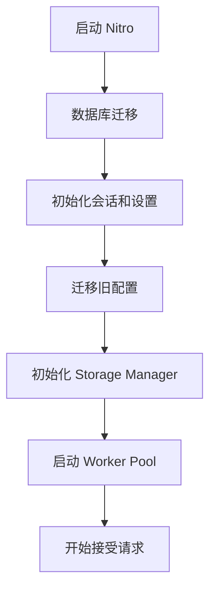
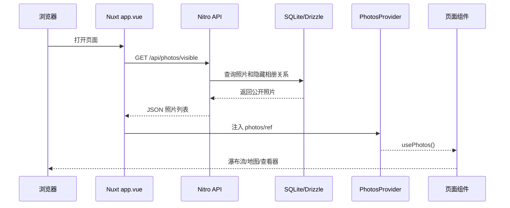
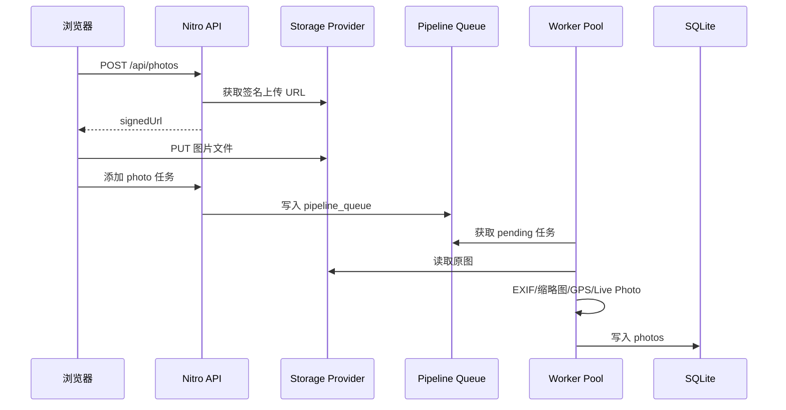

# ChronoFrame 项目框架调研

> 调研对象：[HoshinoSuzumi/chronoframe](https://github.com/HoshinoSuzumi/chronoframe)
>
> 调研重点：项目技术栈、目录组织、Nuxt 前后端结构、数据层、存储层、上传处理队列、状态管理、配置系统和运行生命周期。

---

## 1. 项目定位

ChronoFrame 是一个自托管的个人照片管理和展示应用，核心功能包括：

- 照片上传和管理；
- 图片瀑布流和照片查看器；
- 相册管理；
- EXIF 元数据解析；
- GPS 和逆向地理编码；
- 地图探索；
- Live Photo / Motion Photo 支持；
- 多种存储后端；
- 管理后台和系统设置；
- OG 图片生成和国际化。

从工程形态上看，它不是典型的前后端分离项目，而是一个 **Nuxt 全栈单体应用**：

```text
Nuxt 4
├── Vue 3 前端页面和组件
├── Nitro 服务端 API
├── Nitro Server Plugins
├── Drizzle ORM
├── SQLite
└── 文件存储和后台任务处理
```

前端和后端共用 TypeScript 类型、数据库模型相关类型和部分工具函数。

---

## 2. 技术栈总览

| 层次 | 技术 |
| --- | --- |
| 应用框架 | Nuxt 4 |
| 前端框架 | Vue 3、`<script setup>` |
| 服务端运行时 | Nitro / Node.js Server |
| 编程语言 | TypeScript |
| 构建工具 | Vite、Nuxt Builder |
| 包管理 | pnpm、pnpm workspace |
| 数据库 | SQLite |
| 数据库驱动 | `better-sqlite3` |
| ORM | Drizzle ORM |
| 数据库迁移 | Drizzle Kit / Drizzle Migrator |
| 状态管理 | Pinia |
| UI | Nuxt UI、Reka UI、TailwindCSS |
| 动画 | Motion Vue |
| 图片处理 | Sharp、HEIC Convert、BMP decoder |
| EXIF | ExifTool Vendored |
| 地图 | MapLibre GL、Mapbox GL |
| 对象存储 | S3、Local、OpenList |
| 国际化 | `@nuxtjs/i18n` |
| 日期处理 | Day.js |
| 图片浏览 | 自研 WebGL Image Viewer |
| 文档站 | VitePress |
| Lint / Format | Oxlint、Oxfmt |

主要依赖定义在：

- [`package.json`](https://github.com/HoshinoSuzumi/chronoframe/blob/main/package.json)
- [`nuxt.config.ts`](https://github.com/HoshinoSuzumi/chronoframe/blob/main/nuxt.config.ts)
- [`pnpm-workspace.yaml`](https://github.com/HoshinoSuzumi/chronoframe/blob/main/pnpm-workspace.yaml)

---

## 3. 项目目录结构

```text
chronoframe/
├── app/                         # Nuxt 应用层
│   ├── assets/                  # CSS、地图样式、图片资源
│   ├── components/              # Vue 组件
│   ├── composables/             # Vue/Nuxt 组合式函数
│   ├── layouts/                 # 页面布局
│   ├── libs/                    # 前端通用库
│   ├── middleware/              # 路由中间件
│   ├── pages/                   # 文件路由页面
│   ├── plugins/                 # 前端插件
│   ├── stores/                  # Pinia Store
│   └── utils/                   # 前端工具函数
│
├── packages/
│   └── webgl-image/             # 独立的 WebGL 图片查看器 workspace 包
│
├── server/                      # Nitro 服务端
│   ├── api/                     # 文件路由 API
│   ├── database/                # Schema 和迁移文件
│   ├── plugins/                 # Nitro 启动插件
│   ├── routes/                  # 非 API 服务端路由
│   ├── services/                # 业务服务层
│   ├── tasks/                   # 服务端任务
│   └── utils/                   # 服务端工具
│
├── shared/                      # 前后端共享代码
│   ├── types/                   # 共享类型
│   └── utils/                   # 共享工具
│
├── i18n/                        # 国际化配置和语言包
├── public/                      # 静态资源
├── docs/                        # VitePress 文档
├── scripts/                     # 项目脚本
├── nuxt.config.ts               # Nuxt 配置
├── drizzle.config.ts            # Drizzle 配置
└── package.json
```

这个项目使用 Nuxt 4 的 `app/` 目录模式，而不是把 `pages/`、`components/` 直接放在仓库根目录。

---

## 4. Nuxt 4 应用层

### 4.1 Nuxt 配置

[`nuxt.config.ts`](https://github.com/HoshinoSuzumi/chronoframe/blob/main/nuxt.config.ts) 注册了多个 Nuxt 模块：

```ts
modules: [
  'reka-ui/nuxt',
  '@nuxt/ui',
  '@nuxt/fonts',
  '@nuxt/icon',
  '@pinia/nuxt',
  'motion-v/nuxt',
  'nuxt-auth-utils',
  '@vueuse/nuxt',
  'dayjs-nuxt',
  '@nuxtjs/i18n',
  'nuxt-mapbox',
  'nuxt-maplibre',
  'nuxt-og-image',
  'nuxt-gtag',
]
```

这些模块分别承担：

- UI 组件和无障碍交互；
- Pinia 自动集成；
- 动画；
- 会话认证；
- VueUse 自动导入；
- 日期和国际化；
- Mapbox / MapLibre；
- OG 图片生成；
- Google Analytics。

### 4.2 自动导入和自动注册

项目大量使用 Nuxt 的自动导入机制：

- `components/` 中的组件可以直接使用；
- `composables/` 中的组合式函数可以直接使用；
- `utils/` 中的部分工具可以自动导入；
- Pinia Store 通过 `@pinia/nuxt` 集成。

例如页面中可以直接使用：

```ts
const { photos } = usePhotos()
const settingsStore = useSettingsStore()
```

不需要显式导入项目内部的 Vue composable 或组件。

### 4.3 Vite 和构建配置

项目对地图依赖做了单独的 vendor chunk：

```ts
if (
  id.includes('/mapbox-gl/') ||
  id.includes('/maplibre-gl/') ||
  id.includes('/nuxt-mapbox/') ||
  id.includes('/nuxt-maplibre/')
) {
  return 'vendor-map'
}
```

这样可以将体积较大的地图依赖独立打包。

同时：

```ts
ssr: {
  noExternal: ['@indoorequal/vue-maplibre-gl']
}
```

用于避免 MapLibre Vue 封装在 SSR / Vite 构建时被错误外部化。

项目使用 `ClientOnly` 包裹地图和部分依赖浏览器环境的组件，避免 SSR 阶段初始化 WebGL 或 DOM。

---

## 5. 前端路由和页面结构

### 5.1 文件路由

Nuxt 根据 `app/pages/` 自动生成路由，例如：

```text
app/pages/index.vue                 /
app/pages/globe.vue                 /globe
app/pages/signin.vue                /signin
app/pages/dashboard/index.vue       /dashboard
app/pages/dashboard/photos.vue      /dashboard/photos
app/pages/dashboard/albums.vue      /dashboard/albums
app/pages/dashboard/settings/map.vue /dashboard/settings/map
app/pages/albums/index.vue          /albums
app/pages/albums/[albumId].vue      /albums/:albumId
app/pages/[...slug].vue             /:slug...
```

`app/pages/[...slug].vue` 主要承担照片详情路由，例如：

```text
/:photoId
```

页面本身不直接渲染所有详情内容，而是通过 Viewer Store 和全局 `PhotoViewer` 控制照片查看器。

### 5.2 Layout

主要布局有：

- `app/layouts/masonry.vue`：公共照片瀑布流页面；
- `app/layouts/dashboard.vue`：后台管理布局；
- `app/layouts/onboarding.vue`：首次启动向导。

首页通过 `masonry` 布局渲染 `MasonryRoot`：

```vue
<MasonryRoot
  :photos="photos"
  columns="auto"
/>
```

后台布局则提供：

- 左侧导航栏；
- 照片管理；
- 相册管理；
- 任务队列；
- 日志；
- 设置页面。

### 5.3 全局路由中间件

[`app/middleware/setup.global.ts`](https://github.com/HoshinoSuzumi/chronoframe/blob/main/app/middleware/setup.global.ts) 会在路由切换前检查设置是否完成初始化：

```ts
const isFirstLaunch = settingsStore.getSetting('system:firstLaunch')
```

如果是首次启动且当前不在 `/onboarding`，则重定向到：

```text
/onboarding
```

所以首次启动向导是通过全局路由中间件实现的，而不是单独的启动页面判断。

---

## 6. 根组件和全局数据流

[`app/app.vue`](https://github.com/HoshinoSuzumi/chronoframe/blob/main/app/app.vue) 是前端应用的主要装配点。

核心初始化顺序：

```ts
const settingsStore = useSettingsStore()
await settingsStore.initSettings()
```

然后根据用户状态请求照片：

```ts
const { data, refresh, status } = await useFetch(() => apiEndpoint.value, {
  watch: [apiEndpoint],
})
```

最后通过 `PhotosProvider` 注入全局照片：

```vue
<PhotosProvider
  :photos="photos"
  :refresh="refresh"
  :status="status"
>
  <NuxtLayout>
    <NuxtPage />
  </NuxtLayout>

  <PhotoViewer
    :photos="viewerPhotos"
    :current-index="currentPhotoIndex"
    :is-open="isViewerOpen"
  />
</PhotosProvider>
```

可以把前端启动结构理解为：

```text
UApp
└── PhotosProvider
    ├── NuxtLayout
    │   └── NuxtPage
    └── PhotoViewer
```

照片数据只请求一次，然后由页面、瀑布流、地图、相册和查看器复用。

---

## 7. 前端状态管理

项目使用 Pinia 管理跨页面状态，主要 Store 包括：

```text
app/stores/
├── settings.ts
├── viewer.ts
└── wizard.ts
```

### 7.1 Settings Store

[`app/stores/settings.ts`](https://github.com/HoshinoSuzumi/chronoframe/blob/main/app/stores/settings.ts) 负责加载公开设置：

```ts
await $fetch('/api/system/settings/all')
```

设置以命名空间保存：

```ts
{
  app: { ... },
  map: { ... },
  location: { ... },
  system: { ... }
}
```

组件可以通过：

```ts
getSetting('map:provider')
getSetting('map')
useSettingRef('app:title')
```

读取配置。

设置 Store 的价值在于：

- 设置只加载一次；
- 前端多个组件共享配置；
- 后台保存配置后可以刷新 Store；
- 地图、主题、标题等组件不需要重复请求设置接口。

### 7.2 Viewer Store

[`app/stores/viewer.ts`](https://github.com/HoshinoSuzumi/chronoframe/blob/main/app/stores/viewer.ts) 管理全局照片查看器：

- 当前照片索引；
- 查看器是否打开；
- 返回路由；
- 是否为直接访问；
- 当前查看器使用的照片子集。

这使得相册详情、首页瀑布流和直接照片 URL 可以共享同一个 `PhotoViewer`。

### 7.3 Wizard Store

`wizard.ts` 用于首次启动配置向导，负责保存向导步骤以及表单状态。

---

## 8. Composables 层

项目通过 composables 封装可复用的前端业务逻辑：

```text
app/composables/
├── useExifLocalization.ts
├── useImageLoader.ts
├── useLivePhotoProcessor.ts
├── usePhotoFilters.ts
├── usePhotoSort.ts
├── usePhotos.ts
├── useSettingsForm.ts
├── useUpload.ts
├── useWebGLWorkState.ts
└── useWizardForm.ts
```

典型职责如下：

| Composable | 职责 |
| --- | --- |
| `usePhotos` | 从 `PhotosProvider` 获取全局照片上下文 |
| `usePhotoFilters` | 标签、相机、镜头、城市、评分等筛选 |
| `usePhotoSort` | 照片排序 |
| `useUpload` | 文件上传进度、重试、中止 |
| `useSettingsForm` | 后台设置字段加载和保存 |
| `useImageLoader` | 图片加载和渐进式加载 |
| `useLivePhotoProcessor` | Live Photo 处理 |
| `useWizardForm` | 首次启动向导表单 |
| `useExifLocalization` | EXIF 枚举值本地化 |

`usePhotos` 本身不请求接口，而是读取由 `PhotosProvider` 注入的上下文：

```ts
const context = inject(PhotosContextKey)
```

这样可以把“数据请求”与“组件消费数据”分离。

---

## 9. Nitro 服务端结构

Nuxt 的服务端部分基于 Nitro，主要目录是：

```text
server/
├── api/
├── database/
├── plugins/
├── routes/
├── services/
├── tasks/
└── utils/
```

### 9.1 API 文件路由

`server/api` 使用文件名自动生成接口：

```text
server/api/photos/index.get.ts
    -> GET /api/photos

server/api/photos/index.post.ts
    -> POST /api/photos

server/api/photos/[photoId]/index.put.ts
    -> PUT /api/photos/:photoId

server/api/photos/upload.put.ts
    -> PUT /api/photos/upload

server/api/albums/index.get.ts
    -> GET /api/albums

server/api/system/settings/all.get.ts
    -> GET /api/system/settings/all
```

HTTP 方法通过文件名后缀表达：

- `.get.ts`
- `.post.ts`
- `.put.ts`
- `.delete.ts`

API handler 使用 Nitro 的事件处理器：

```ts
export default eventHandler(async (event) => {
  // 读取请求、校验、业务处理并返回响应
})
```

### 9.2 API 鉴权

需要登录的接口通常在 handler 开头调用：

```ts
await requireUserSession(event)
```

例如：

- 上传照片；
- 添加队列任务；
- 修改照片；
- 修改设置；
- 管理相册。

公共读取接口则根据隐藏相册逻辑返回有限数据。

### 9.3 参数校验

部分 API 使用 Zod 校验请求体，例如队列任务接口：

```ts
const payloadSchema = z.discriminatedUnion('type', [
  z.object({
    type: z.literal('photo'),
    storageKey: z.string().nonempty(),
  }),
  // ...
])
```

这样可以根据任务 `type` 对不同 payload 进行类型安全校验。

---

## 10. 数据层：SQLite + Drizzle ORM

### 10.1 数据库连接

[`server/utils/db.ts`](https://github.com/HoshinoSuzumi/chronoframe/blob/main/server/utils/db.ts) 使用 `better-sqlite3` 创建 SQLite 连接，再交给 Drizzle：

```ts
sqliteInstance = new Database('data/app.sqlite3')
dbInstance = drizzle(sqliteInstance, { schema })
```

数据库连接是单例，并启用了 WAL：

```ts
sqliteInstance.pragma('journal_mode = WAL')
sqliteInstance.pragma('synchronous = NORMAL')
```

这样可以改善读取和后台队列处理同时进行时的并发性能。

### 10.2 数据库 Schema

Schema 位于：

[`server/database/schema.ts`](https://github.com/HoshinoSuzumi/chronoframe/blob/main/server/database/schema.ts)

主要表包括：

| 表 | 用途 |
| --- | --- |
| `users` | 用户和管理员 |
| `photos` | 照片、EXIF、缩略图、GPS |
| `pipeline_queue` | 后台图片处理任务 |
| `photo_reactions` | 照片反应/表态 |
| `albums` | 相册 |
| `album_photos` | 相册和照片的多对多关系 |
| `settings` | 系统设置 |
| `settings_storage_providers` | 存储 provider 配置 |

### 10.3 照片表

`photos` 表是项目的核心数据表，包含：

```text
id
标题和描述
宽高和宽高比
拍摄时间
存储 key
原图 URL
缩略图 URL
ThumbHash
EXIF JSON
author GPS
country / city / locationName
Live Photo 信息
```

数据库中同时保存业务元数据和文件存储引用，照片文件本身不存入 SQLite。

### 10.4 数据库迁移

迁移文件位于：

```text
server/database/migrations/
```

项目启动时由：

[`server/plugins/0.db-migrate.ts`](https://github.com/HoshinoSuzumi/chronoframe/blob/main/server/plugins/0.db-migrate.ts)

执行：

```ts
migrate(db, {
  migrationsFolder: resolve('./server/database/migrations'),
})
```

数据库默认路径：

```text
./data/app.sqlite3
```

可以通过 `DATABASE_URL` 改变路径。

常用数据库命令：

```bash
pnpm db:generate
pnpm db:migrate
pnpm db:push
pnpm db:studio
pnpm db:check
```

---

## 11. 设置系统

ChronoFrame 没有把所有配置都硬编码在环境变量中，而是构建了一套数据库设置系统。

核心代码：

- [`server/services/settings/contants.ts`](https://github.com/HoshinoSuzumi/chronoframe/blob/main/server/services/settings/contants.ts)
- [`server/services/settings/settingsManager.ts`](https://github.com/HoshinoSuzumi/chronoframe/blob/main/server/services/settings/settingsManager.ts)
- [`app/stores/settings.ts`](https://github.com/HoshinoSuzumi/chronoframe/blob/main/app/stores/settings.ts)

### 11.1 设置初始化

`DEFAULT_SETTINGS` 定义默认设置，例如：

```text
system:firstLaunch
app:title
app:slogan
app:appearance.theme
map:provider
map:mapbox.token
map:maplibre.token
location:language
storage:provider
```

启动时，SettingsManager 会检查数据库中是否存在对应设置，不存在则插入默认值。

### 11.2 设置类型

设置支持：

- string；
- number；
- boolean；
- json。

SettingsManager 负责：

- 序列化；
- 反序列化；
- 枚举值校验；
- readonly 校验；
- 内存缓存；
- 更新后的 provider 切换。

### 11.3 动态设置表单

后台设置页面通过 API 获取字段描述：

```text
/api/system/settings/fields
```

返回的字段包含：

```ts
{
  key,
  type,
  value,
  defaultValue,
  label,
  description,
  ui
}
```

前端 `SettingField.vue` 根据 `ui.type` 动态生成：

- input；
- password；
- select；
- radio；
- toggle；
- number；
- textarea 等。

这让新增设置时，不一定需要为每个配置项手写一套页面表单。

---

## 12. 存储层设计

项目通过 Storage Provider 抽象文件存储。

目录：

```text
server/services/storage/
├── interfaces.ts
├── manager.ts
├── index.ts
├── events.ts
└── providers/
    ├── local.ts
    ├── s3.ts
    └── openlist.ts
```

支持：

- S3 兼容存储；
- 本地文件系统；
- OpenList。

### 12.1 Provider Factory

[`server/services/storage/manager.ts`](https://github.com/HoshinoSuzumi/chronoframe/blob/main/server/services/storage/manager.ts) 根据配置创建 provider：

```ts
switch (config.provider) {
  case 's3':
    return new S3StorageProvider(config, logger)
  case 'local':
    return new LocalStorageProvider(config, logger)
  case 'openlist':
    return new OpenListStorageProvider(config, logger)
}
```

业务层只依赖统一的 `StorageProvider` 接口，不直接依赖 S3 SDK 或文件系统 API。

### 12.2 StorageManager

`StorageManager` 负责：

- 保存当前 provider；
- 获取当前 provider；
- 动态切换 provider；
- 广播 provider changed/error 事件。

设置系统修改 `storage:provider` 后，会异步触发 StorageManager 切换。

### 12.3 服务端生命周期

[`server/plugins/3.storage.ts`](https://github.com/HoshinoSuzumi/chronoframe/blob/main/server/plugins/3.storage.ts) 会：

1. 启动时尝试初始化 active provider；
2. 如果尚未完成 onboarding，则允许延迟初始化；
3. 每次请求时检查 storage manager 是否可用；
4. 将 storage manager 挂到 `event.context.storage`。

这种设计可以支持用户在首次启动向导中配置存储，而不必重启服务。

---

## 13. 上传和异步处理架构

照片上传不是在 HTTP 请求中同步完成所有处理，而是分成：

```text
准备上传
  -> 直传文件
  -> 创建处理任务
  -> Worker Pool 异步处理
  -> 写入 photos 表
```

### 13.1 准备上传

[`server/api/photos/index.post.ts`](https://github.com/HoshinoSuzumi/chronoframe/blob/main/server/api/photos/index.post.ts) 负责：

- 检查登录；
- 校验文件名；
- 生成 storage key；
- 重复文件检测；
- 生成签名 URL 或内部上传 URL。

如果 provider 支持预签名 URL，就返回外部直传地址：

```ts
const signedUrl = await storageProvider.getSignedUrl(...)
```

否则使用内部接口：

```text
/api/photos/upload?key=...
```

### 13.2 文件上传

[`server/api/photos/upload.put.ts`](https://github.com/HoshinoSuzumi/chronoframe/blob/main/server/api/photos/upload.put.ts) 负责内部上传：

- 登录检查；
- MIME 白名单检查；
- 文件大小限制；
- 读取请求体；
- 调用 Storage Provider 写入文件。

默认最大文件大小为 256 MB。

### 13.3 创建任务

[`server/api/queue/add-task.post.ts`](https://github.com/HoshinoSuzumi/chronoframe/blob/main/server/api/queue/add-task.post.ts) 使用 Zod 校验任务，并把任务写入 `pipeline_queue`。

照片任务 payload：

```ts
{
  type: 'photo',
  storageKey: string,
  eraseLocation?: boolean
}
```

队列中还支持：

```text
live-photo-video
photo-reverse-geocoding
photo-erase-location
```

### 13.4 Worker Pool

[`server/plugins/4.pipeline-queue.ts`](https://github.com/HoshinoSuzumi/chronoframe/blob/main/server/plugins/4.pipeline-queue.ts) 启动 Worker Pool：

```ts
const workerPool = new WorkerPool({
  workerCount: 5,
  intervalMs: 1500,
  intervalOffset: 300,
  enableLoadBalancing: true,
})
```

启动时拥有 5 个 worker，定期从 SQLite 队列中取出任务。

Worker Pool 还支持：

- 任务轮询；
- 失败重试；
- 任务优先级；
- 最大重试次数；
- 负载均衡；
- 任务统计；
- 优雅关闭。

### 13.5 照片处理阶段

单个照片任务大致执行：

```text
1. 读取存储对象
2. HEIC 转 JPEG
3. 提取宽高和图片元数据
4. 生成缩略图和 ThumbHash
5. 提取 EXIF
6. 提取照片标题、日期、标签和描述
7. 解析 GPS
8. 逆向地理编码
9. 处理 Motion Photo
10. 匹配 Live Photo 视频
11. 写入 photos 表
```

处理结果最终写入 `photos` 表，地图展示所需的 GPS、城市、缩略图和 EXIF 都在这一阶段生成。

---

## 14. 后台队列数据模型

`pipeline_queue` 表记录任务状态：

```text
pending       等待处理
in-stages     正在处理
completed     已完成
failed        已失败
```

还记录当前阶段：

```text
preprocessing
metadata
thumbnail
exif
motion-photo
reverse-geocoding
live-photo
location-erase
```

失败时会根据 `attempts` 和 `maxAttempts` 决定是否重新加入队列，并使用指数退避：

```text
1000ms -> 2000ms -> 4000ms ...
```

这套设计避免上传请求长时间阻塞，也让 EXIF、缩略图、地理编码等重量级工作可重试。

---

## 15. Server Plugins 启动顺序

Nuxt/Nitro 服务端插件通过文件名控制顺序：

```text
server/plugins/
├── 0.db-migrate.ts
├── 0.session-password.ts
├── 1.seed.ts
├── 2.settings-manager.ts
├── 3.storage.ts
├── 4.pipeline-queue.ts
└── h3-headers-compat.ts
```

可以理解为：



### 15.1 数据库迁移

`0.db-migrate.ts` 创建数据库目录和连接，然后执行 Drizzle migration。

### 15.2 设置初始化

`2.settings-manager.ts`：

- 初始化默认设置；
- 清理废弃配置；
- 将旧 runtimeConfig 迁移到数据库设置；
- 同步 GitHub OAuth 配置。

### 15.3 存储初始化

`3.storage.ts` 读取 active storage provider，并创建全局 StorageManager。

### 15.4 队列初始化

`4.pipeline-queue.ts` 启动后台 worker，开始消费 `pipeline_queue`。

---

## 16. 业务服务层

`server/services/` 按业务领域拆分：

```text
server/services/
├── image/
│   ├── blurhash.ts
│   ├── exif.ts
│   ├── histogram.ts
│   ├── processor.ts
│   └── thumbnail.ts
├── location/
│   └── geocoding.ts
├── pipeline-queue/
│   ├── index.ts
│   ├── manager.ts
│   └── worker-pool.ts
├── settings/
│   ├── contants.ts
│   ├── settingsManager.ts
│   └── ui-config.ts
├── storage/
│   ├── events.ts
│   ├── interfaces.ts
│   ├── manager.ts
│   └── providers/
└── video/
    ├── livephoto.ts
    ├── motion-photo.ts
    └── scanner.ts
```

这种拆分方式接近领域服务设计：

- API 层负责请求和权限；
- Service 层负责业务；
- Database 层负责持久化；
- Provider 层负责外部资源；
- Queue 层负责异步调度。

例如 API 不直接处理 Sharp 和 ExifTool，而是调用服务层：

```ts
extractExifData(...)
processImageMetadataAndSharp(...)
generateThumbnailAndHash(...)
extractLocationFromGPS(...)
```

---

## 17. Shared 层

`shared/` 用于存放前后端都需要的类型和工具：

```text
shared/
├── types/
│   ├── auth.d.ts
│   ├── config.ts
│   ├── global.d.ts
│   ├── map.ts
│   ├── photo.ts
│   ├── settings.ts
│   └── storage.ts
└── utils/
    ├── index.ts
    └── u8array.ts
```

共享内容包括：

- `PhotoMarker`；
- `NeededExif`；
- `SettingConfig`；
- `FieldDescriptor`；
- 存储配置类型；
- 压缩和字节数组工具。

服务端数据库类型则通过 Drizzle 推导：

```ts
export type Photo = typeof schema.photos.$inferSelect
```

这减少了手写 DTO 与数据库实际结构不一致的问题。

---

## 18. 独立 workspace 包：WebGL Image Viewer

项目使用 pnpm workspace 管理一个独立包：

```text
packages/webgl-image/
```

包名：

```text
@chronoframe/webgl-image
```

它包含：

```text
src/
├── components/
│   └── WebGLImageViewer.vue
├── core/
│   └── WebGLImageViewerEngine.ts
├── workers/
│   └── image-decoder.worker.js
├── shaders.ts
├── constants.ts
└── types/
```

这个包负责大尺寸图片查看，不和 Nuxt 页面逻辑强耦合。

开发时主项目会先启动该包：

```json
{
  "dev": "run-p dev:dep dev:wait-only",
  "dev:dep": "pnpm --filter @chronoframe/webgl-image dev",
  "dev:wait-only": "wait-on packages/webgl-image/dist && nuxt dev --host"
}
```

也就是说，主应用启动前需要确保 WebGL viewer 已经构建出 `dist`。

构建命令：

```bash
pnpm build:deps
pnpm build
```

---

## 19. 图片查看器和页面解耦

图片查看器通过：

- `PhotoViewer` 组件；
- `viewer` Pinia Store；
- `WebGLImageViewer` workspace 包；

组合实现。

页面只需要传入：

```text
photos
current-index
is-open
```

并监听：

```text
close
index-change
```

因此首页瀑布流、相册页面、照片详情页都可以复用同一个查看器，而不需要复制图片浏览逻辑。

---

## 20. 配置与运行时配置

`nuxt.config.ts` 中的 `runtimeConfig` 分成两类：

### public 配置

会暴露给浏览器，例如：

```text
public.app
public.map
public.analytics
public.oauth
```

### server-only 配置

只在服务端可用，例如：

```text
mapbox.accessToken
nominatim.baseUrl
provider.s3
provider.local
provider.openlist
upload
```

存储密钥、S3 Secret、OAuth Secret 等不会放入 public 配置。

项目当前还会把部分旧环境变量配置迁移到数据库设置系统，因此运行时配置和数据库设置之间存在兼容迁移层。

---

## 21. 国际化和 UI 框架

国际化配置位于：

```text
i18n/
├── i18n.config.ts
├── i18n.options.ts
├── localeDetector.ts
└── locales/
    ├── en.json
    ├── ja.json
    ├── ru.json
    ├── zh-Hans.json
    ├── zh-Hant-HK.json
    └── zh-Hant-TW.json
```

前端通过 `$t()` 读取翻译：

```vue
{{ $t('title.dashboard') }}
```

UI 主要基于 Nuxt UI 和 Reka UI，布局、表单、弹窗、HoverCard、Dashboard Sidebar 等都使用组件化方式完成。

TailwindCSS 通过：

```ts
css: ['~/assets/css/tailwind.css']
```

接入 Nuxt。

---

## 22. 一次请求的典型链路

以“获取公共照片列表”为例：



以“上传照片”为例：



---

## 23. 运行命令和部署形态

### 开发

```bash
pnpm install
pnpm dev
```

`pnpm dev` 会并行启动：

1. WebGL image workspace 包；
2. 等待该包构建完成；
3. 启动 Nuxt 开发服务器。

### 生产构建

```bash
pnpm build:deps
pnpm build
pnpm preview
```

### Docker

项目通过 Nitro Node Server 运行，生产部署主要使用 Docker：

```bash
docker pull ghcr.io/hoshinosuzumi/chronoframe:latest
```

并把数据目录挂载到：

```text
/app/data
```

其中通常包含：

- SQLite 数据库；
- 本地存储照片；
- 缩略图；
- EXIF 临时工作目录。

---

## 24. 框架设计特点

### 24.1 全栈单体，部署简单

前端、API、数据库访问、后台任务都在一个 Nuxt 项目内，适合个人相册和自托管部署。

### 24.2 数据库和文件存储解耦

SQLite 保存照片元数据，Storage Provider 保存原图和缩略图。

因此可以更换：

- S3；
- 本地磁盘；
- OpenList；

而不用修改照片业务逻辑。

### 24.3 队列化处理重任务

图片处理、EXIF、缩略图、地理编码等工作放在后台队列，不阻塞上传请求。

### 24.4 配置系统可动态更新

设置保存在数据库中，后台可以修改，不必每次修改配置都重新构建前端。

### 24.5 共享类型减少前后端不一致

Drizzle Schema 推导服务端类型，`shared/types` 负责前后端共享的业务类型。

### 24.6 功能组件化

地图、图片查看器、上传、瀑布流、设置字段、MiniMap 等均拆成独立组件或 workspace 包，便于复用。

---

## 25. 当前架构的限制

### 25.1 服务端和后台任务共用一个 Node 进程

Worker Pool 运行在 Nitro 服务进程中：

```text
HTTP API + SSR + Worker Pool
```

优点是部署简单，缺点是：

- 图片处理可能和 API 抢占 CPU、内存；
- 进程崩溃会同时影响 API 和后台任务；
- 多实例部署时需要额外处理队列竞争和 worker 规模。

### 25.2 SQLite 适合中小规模部署

SQLite + WAL 很适合个人相册，但如果：

- 并发上传很多；
- 多实例部署；
- 任务队列规模大；
- 需要高并发后台管理；

则可能需要迁移到 PostgreSQL 或独立任务队列。

### 25.3 当前队列依赖数据库轮询

Worker Pool 定期轮询 `pipeline_queue`，实现简单，但比 Redis、RabbitMQ、BullMQ 等专业任务队列实时性和扩展性弱。

### 25.4 页面级全量数据加载

照片列表在 `app.vue` 全局加载，地图和瀑布流复用同一批数据。照片数量增加后，前端内存、初始请求和渲染压力都会增加。

### 25.5 配置来源较多

项目同时存在：

- 环境变量；
- `runtimeConfig`；
- 数据库 `settings`；
- Storage Provider 配置表。

虽然有迁移层，但新开发者需要先理解配置优先级和初始化顺序。

---

## 26. 推荐源码阅读顺序

如果要从整体框架开始阅读，建议按以下顺序：

1. [`package.json`](https://github.com/HoshinoSuzumi/chronoframe/blob/main/package.json) —— 依赖和脚本；
2. [`nuxt.config.ts`](https://github.com/HoshinoSuzumi/chronoframe/blob/main/nuxt.config.ts) —— Nuxt 模块和构建配置；
3. [`app/app.vue`](https://github.com/HoshinoSuzumi/chronoframe/blob/main/app/app.vue) —— 前端根组件和全局数据流；
4. [`app/middleware/setup.global.ts`](https://github.com/HoshinoSuzumi/chronoframe/blob/main/app/middleware/setup.global.ts) —— 首次启动重定向；
5. [`app/layouts/`](https://github.com/HoshinoSuzumi/chronoframe/tree/main/app/layouts) —— 页面布局；
6. [`app/stores/settings.ts`](https://github.com/HoshinoSuzumi/chronoframe/blob/main/app/stores/settings.ts) —— 前端设置状态；
7. [`server/plugins/0.db-migrate.ts`](https://github.com/HoshinoSuzumi/chronoframe/blob/main/server/plugins/0.db-migrate.ts) —— 数据库启动；
8. [`server/plugins/2.settings-manager.ts`](https://github.com/HoshinoSuzumi/chronoframe/blob/main/server/plugins/2.settings-manager.ts) —— 设置初始化和迁移；
9. [`server/plugins/3.storage.ts`](https://github.com/HoshinoSuzumi/chronoframe/blob/main/server/plugins/3.storage.ts) —— 存储初始化；
10. [`server/plugins/4.pipeline-queue.ts`](https://github.com/HoshinoSuzumi/chronoframe/blob/main/server/plugins/4.pipeline-queue.ts) —— worker 启动；
11. [`server/database/schema.ts`](https://github.com/HoshinoSuzumi/chronoframe/blob/main/server/database/schema.ts) —— 数据模型；
12. [`server/api/`](https://github.com/HoshinoSuzumi/chronoframe/tree/main/server/api) —— API 文件路由；
13. [`server/services/`](https://github.com/HoshinoSuzumi/chronoframe/tree/main/server/services) —— 业务服务层；
14. [`packages/webgl-image/`](https://github.com/HoshinoSuzumi/chronoframe/tree/main/packages/webgl-image) —— 大图 WebGL 查看器。

---

## 27. 总结

ChronoFrame 的整体框架可以表示为：

```text
Nuxt 4 全栈应用
│
├── 前端层
│   ├── Vue 3 页面
│   ├── Layout / Components
│   ├── Pinia Store
│   ├── Composables
│   └── WebGL Image Viewer
│
├── 服务端接口层
│   ├── Nitro API 文件路由
│   ├── Session 鉴权
│   ├── Zod 参数校验
│   └── 文件/图片/设置接口
│
├── 业务服务层
│   ├── Image Service
│   ├── Location Service
│   ├── Storage Service
│   ├── Settings Service
│   ├── Video Service
│   └── Pipeline Queue Service
│
├── 数据和资源层
│   ├── SQLite
│   ├── Drizzle ORM
│   ├── S3 / Local / OpenList
│   └── EXIF / Sharp / 缩略图
│
└── 后台运行层
    ├── Nitro Plugins
    ├── Worker Pool
    ├── 队列重试
    └── 优雅关闭
```

它的核心思路是：

> **用 Nuxt 把前端、API、SSR 和服务端生命周期统一起来；用 SQLite 保存元数据；用 Storage Provider 抽象文件；用数据库队列把图片处理异步化；用共享 TypeScript 类型连接前后端。**

如果要在其他照片项目中借鉴 ChronoFrame，最值得复用的是以下几层：

```text
业务页面
  -> composable / store
  -> Nitro API
  -> service
  -> repository / Drizzle
  -> storage provider 或后台队列
```

这套结构对于个人相册、自托管媒体管理、照片地图和图片处理类应用都比较适合。
